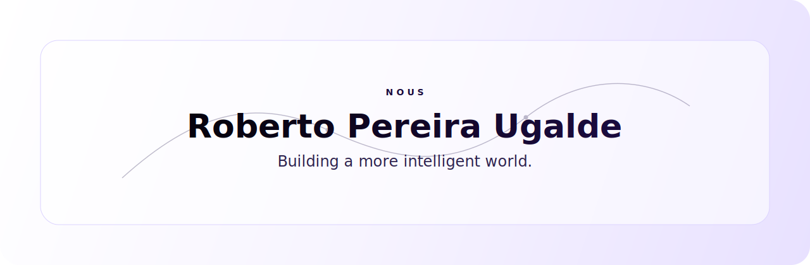

  <a href="https://nous.cr">NOUS</a>
  ·
  <a href="https://robertopereiraugalde.com">robertopereiraugalde.com</a>
  ·
  San Jose, Costa Rica

 

## I build systems for intelligence.

I am the founder of **NOUS**, an AI company built around a simple belief:

> The future will belong to organizations that learn faster, decide better, and turn intelligence into daily practice.

Most companies will not be transformed by more software. 
They will be transformed by clearer thinking, better workflows, trusted automation, and systems that help people do the best work of their lives.

That is what I am building.

 

## NOUS

NOUS helps organizations move from AI experimentation to intelligent operations.

Strategy becomes systems. 
Systems become habits. 
Habits become culture.

 

## Principles

- Simplicity is intelligence made usable.
- Taste matters because people trust what feels clear.
- AI should make organizations more human, not less.
- The first useful deployment is more valuable than the perfect plan.
- Real transformation compounds quietly.

 

## Current Work

Building NOUS in Costa Rica and LatAm.

Designing intelligent customer interfaces, agentic workflows, and operational systems that help companies think, serve, and execute with greater clarity.

Writing and building in public where the work can be shared.

 

  <strong>Building a more intelligent world.</strong>

