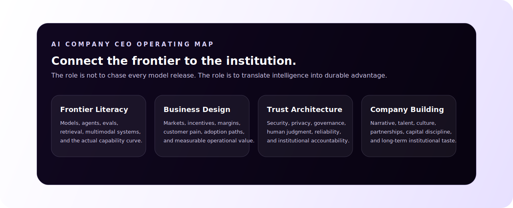

<p align="center">
  <a href="https://nous.cr"><strong>NOUS</strong></a>
  ·
  <a href="https://robertopereiraugalde.com"><strong>robertopereiraugalde.com</strong></a>
  ·
  <strong>San Jose, Costa Rica</strong>
</p>

## The Short Version

I am building **NOUS** to help organizations turn artificial intelligence into real institutional capability.

Not AI as a novelty. Not AI as a disconnected tool. AI as an operating layer for better decisions, faster execution, stronger customer relationships, and organizations that learn from their own work.

My role is to connect the frontier of intelligence with the reality of companies: strategy, product, systems, talent, trust, economics, and adoption.

## What An AI Company CEO Has To Understand

The job is not just to understand models. It is to understand what intelligence changes.

An excellent AI company CEO has to operate across several layers at once:

| Layer | What It Means |
|---|---|
| **Frontier literacy** | Know where model capabilities are going, what is real now, what is fragile, and how to evaluate systems instead of believing demos. |
| **Strategic judgment** | Identify where intelligence changes cost, speed, quality, revenue, risk, or decision clarity. |
| **Product taste** | Turn complex capability into interfaces people can trust, understand, and use repeatedly. |
| **Systems thinking** | Design workflows, feedback loops, memory, data flows, permissions, and human-in-the-loop controls. |
| **Business design** | Understand incentives, margins, procurement, adoption, pricing, distribution, and the operational reality of customers. |
| **Trust architecture** | Treat security, privacy, governance, reliability, and accountability as part of the product, not compliance theater. |
| **Institution building** | Build a company with a clear narrative, high standards, strong people, durable culture, and a long-term point of view. |



## The NOUS Thesis

AI will matter most when it becomes part of how organizations operate.

The winning companies will not be the ones that collect the most tools. They will be the ones that redesign work around intelligence: capturing context, routing decisions, automating coordination, improving service, preserving knowledge, and learning faster than competitors.

NOUS exists to make that transformation practical.

## What I Am Building Toward

| Direction | Why It Matters |
|---|---|
| **AI transformation strategy** | Organizations need a clear path from experimentation to durable operational value. |
| **Intelligent customer interfaces** | Every first contact should become structured context, not lost information. |
| **Agentic workflows** | Teams need systems that can reason, act, ask for help, and improve over time. |
| **Knowledge infrastructure** | Institutional memory should become searchable, usable, and compounding. |
| **Executive AI adoption** | Leaders need judgment, governance, and operating models, not tool lists. |

## How I Think

```text
Start with the institution, not the model.
Find the workflow where intelligence creates leverage.
Design the smallest useful system that proves the thesis.
Make trust, measurement, and adoption part of the architecture.
Turn the result into a repeatable operating capability.
```

## Current Focus

- Building NOUS as an AI transformation company for Costa Rica and LatAm.
- Designing Hermes as an intelligent first-contact and support layer.
- Developing public thinking on AI adoption, company design, and intelligent operations.
- Turning private production work into shareable patterns, case studies, and reference architectures where possible.

## What I Value

- **Taste** over noise.
- **Judgment** over hype.
- **Systems** over isolated tools.
- **Adoption** over demos.
- **Trust** over unchecked automation.
- **Compounding intelligence** over one-off efficiency.

## Public Work

Most serious production work is private, client-facing, or owned by organizations. This profile is the public surface for what can be shared: essays, experiments, case studies, reference architectures, and reusable patterns.

Planned public artifacts:

- AI transformation field notes
- agent and assistant workflow patterns
- executive guides for useful AI adoption
- trust and governance checklists for applied AI systems
- case studies on intelligent operations

<p align="center">
  <strong>Building a more intelligent world.</strong>
  <br>
  <a href="https://nous.cr">NOUS</a>
  ·
  <a href="https://robertopereiraugalde.com">Personal site</a>
</p>
